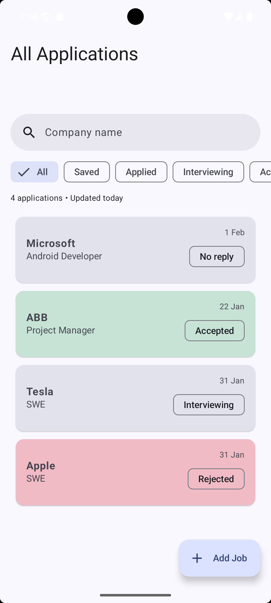
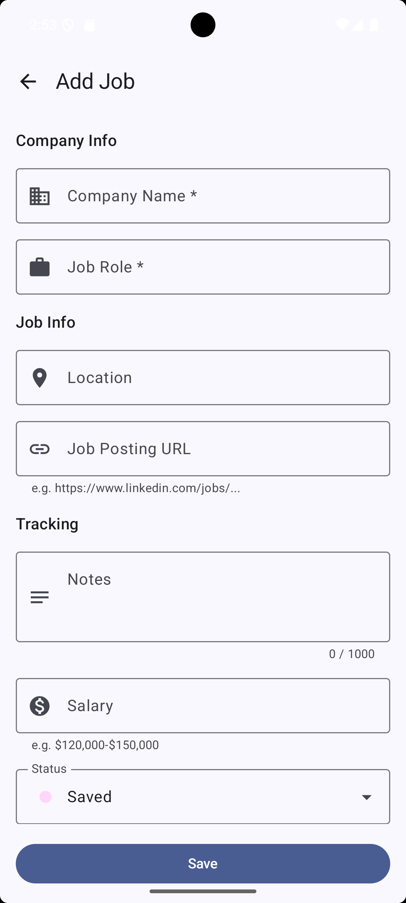
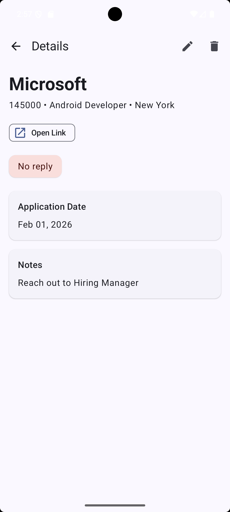
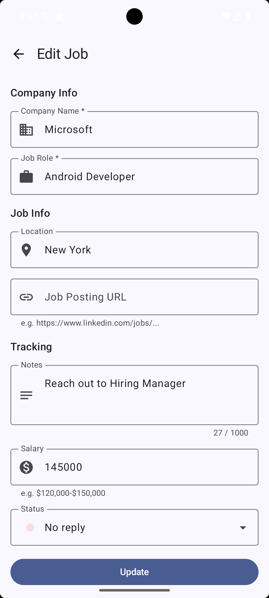

📋 JobTrack

JobTrack is an Android application that helps users track job applications, manage application details, and stay organized throughout the job search process.

✨ Features

- Track job applications
- Add, edit, and delete jobs
- Search jobs by company name
- View detailed job information
- Open job posting links
- Offline-first using Room
- Clean and minimal UI

🛠 Tech Stack

- Kotlin
- Jetpack Compose
- Material 3
- MVVM Architecture
- Room
- Hilt
- Navigation Compose
- Coroutines & Flow

📸 Screenshots

<p float="left">
  
  
  
  
</p>

▶️ How to Run

1. Clone the repository
   ```bash
   git clone https://github.com/vaibhav-pawade/JobTrack.git
